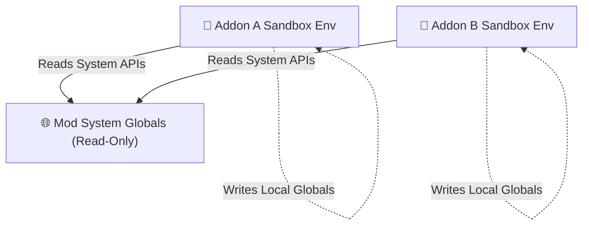

# 🛡️ Modern Engine Architecture, Sandbox Isolation & Service Registry

LuaTweaker adopts high-performance architectural patterns inspired by professional game engine design (such as Luau Service Lookups & Protected Metatables).

---

## 1. 🛡️ Per-Addon Isolated Sandbox Environment

To prevent script conflicts where multiple addons attempt to modify global variables or crash each other (the *"drawing on the same paper"* problem), LuaTweaker assigns an **isolated sandbox environment table** to every script file.



- **Conflict Prevention**: If Addon A declares `myGlobal = 100`, it writes ONLY to Addon A's isolated environment without polluting Addon B or the core mod.
- **Fault Isolation**: If Addon A throws a runtime script exception, LuaTweaker safely isolates the error. Mod APIs and other Addon scripts continue running smoothly.

---

## 2. 🏬 Service Registry Lookup Paradigm (`Mod:GetService` / `game:GetService`)

Instead of dumping dozens of APIs directly into global namespace, LuaTweaker provides a clean **Service Registry lookup paradigm**:

```lua
-- Access services cleanly using Mod:GetService or game:GetService
local recipes  = Mod:GetService("Recipes")
local events   = Mod:GetService("Events")
local world    = game:GetService("World")
local bossbar  = Mod:GetService("BossBar")
local loot     = Mod:GetService("Loot")
local entities = Mod:GetService("Entities")
```

### Supported Services List

| Service Name | API Object | Purpose |
|--------------|------------|---------|
| `"Recipes"` | `recipes` | Item crafting, smelting, brewing & trade recipes |
| `"Events"` | `events` | Server, client & game event hooks |
| `"World"` | `world` | Weather, time, game days, game rules & commands |
| `"BossBar"` | `bossbar` | Custom BossBar creation & player targeting |
| `"Entities"` | `entities` | Mob spawning, armor gear & attribute modifiers |
| `"Loot"` | `loot` | Mob & block drop table modifications |
| `"Startup"` | `startup` | Custom item, block, fluid & tab creation |
| `"WorldGen"` | `worldgen` | Dynamic ore generation & mob spawn rules |
| `"Tags"` | `tags` | Item & block tag registration |
| `"Commands"` | `commands` | Dynamic server commands |
| `"Jei"` | `jei` | JEI / REI / EMI item hiding & custom categories |
| `"Nbt"` | `nbt` | Easy SNBT & table conversion helpers |
| `"Enums"` | `enums` | Structured constants (Colors, Rarity, Slots) |
| `"Utils"` | `utils` | Chance, random choice & math utilities |

---

## 3. 🔒 Read-Only Protected Metatables

Core system tables (`enums`, `utils`, `nbt`, `game`, `Mod`) are locked using **protected Lua metatables (`__newindex`)**.

```lua
-- If a script attempts to overwrite or delete a system API:
enums.Rarity = nil

-- Lua raises an instant security error:
-- [Security/Protection] Attempt to modify read-only service table 'enums' (property 'Rarity').
```

---

## 4. 📁 Scoped Script Directories

Execution stages are strictly partitioned:

1. **`startup_scripts/`**: Executes once at game startup (Registers custom items, blocks, fluids, tabs).
2. **`server_scripts/`**: Executes on world load / server start (Recipes, mob loot, world rules, bossbars).
3. **`client_scripts/`**: Executes on client load (Tooltips, JEI category registration).
